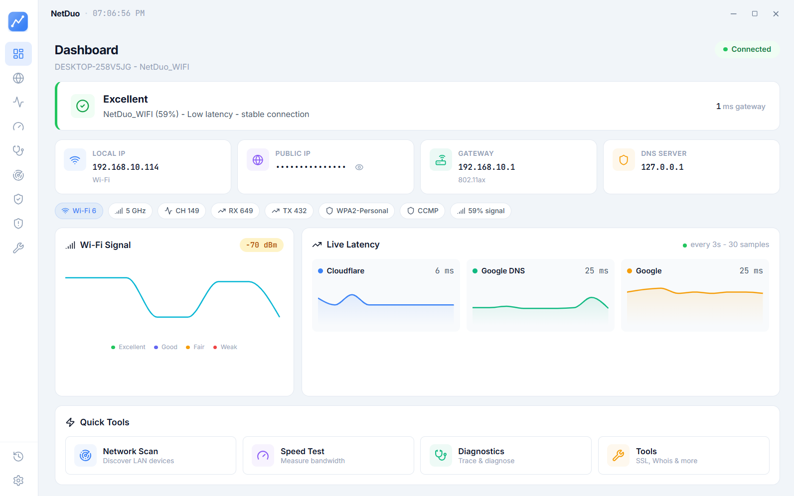
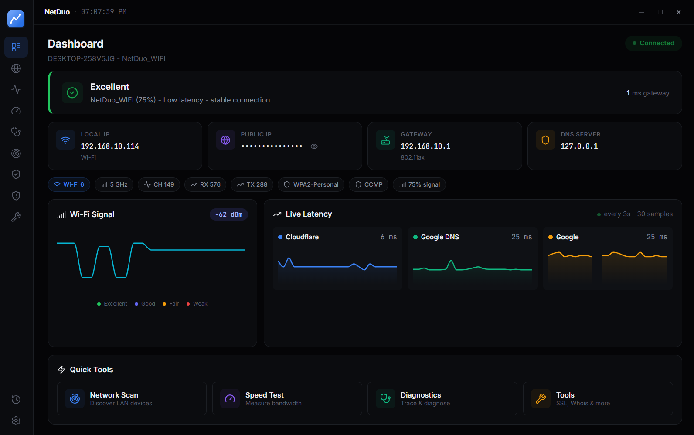
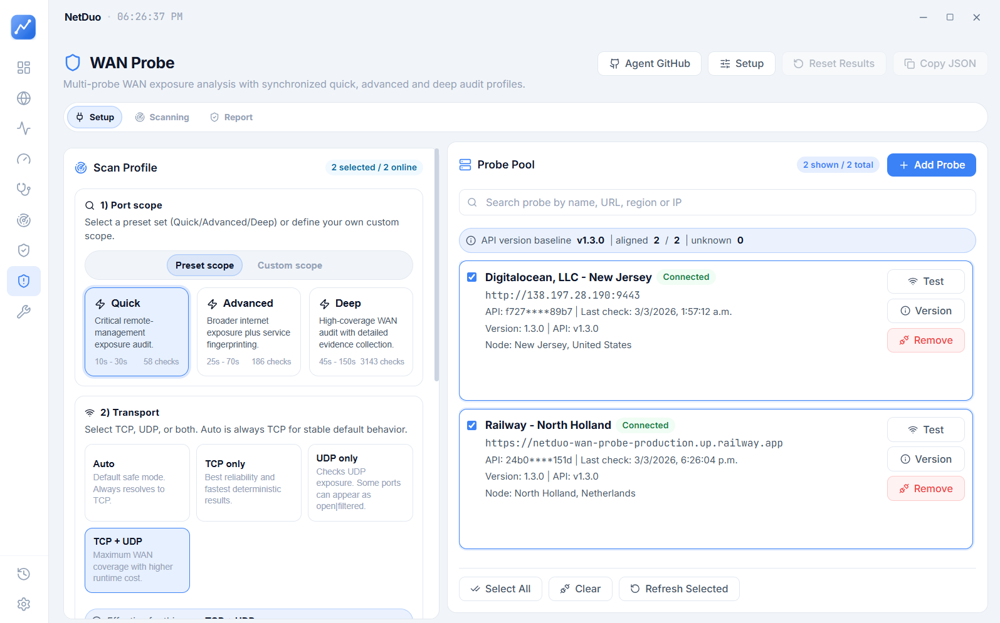
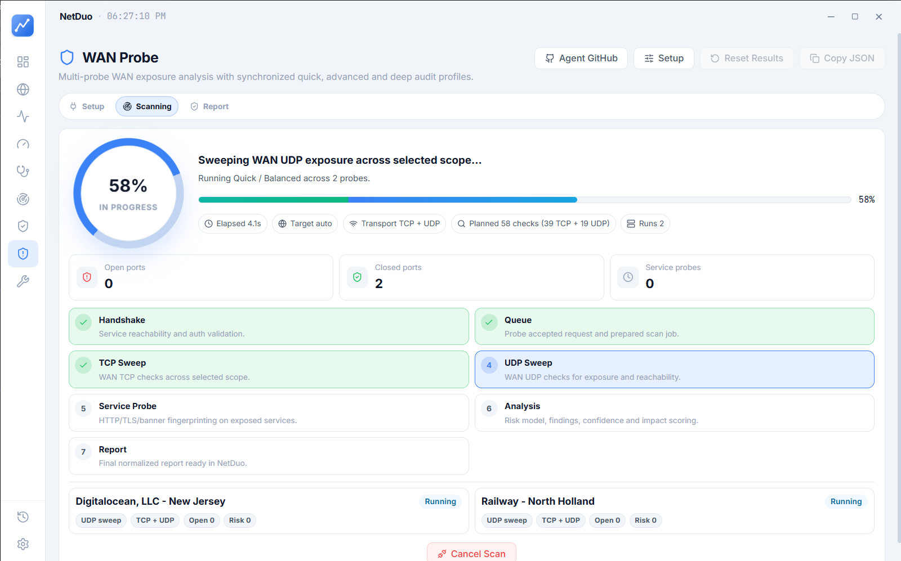
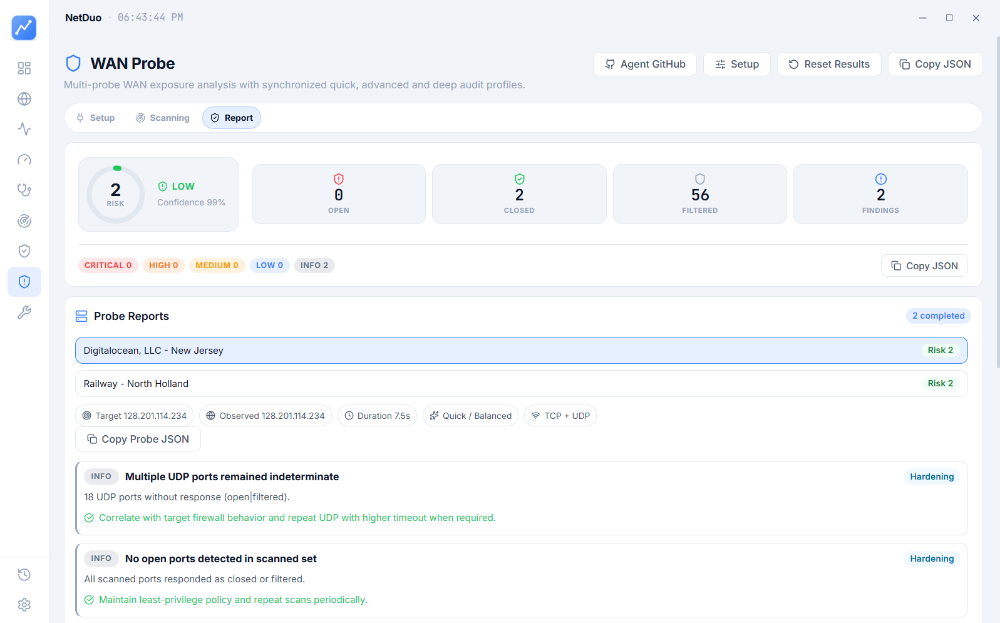
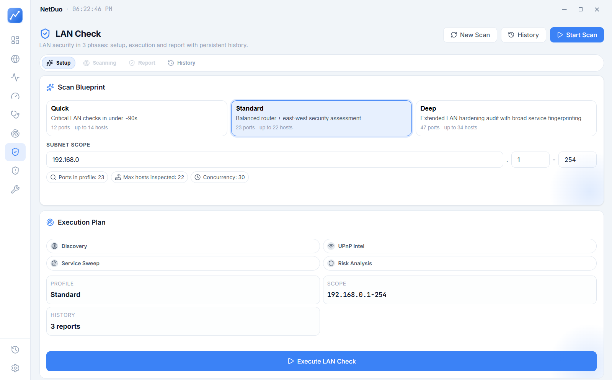
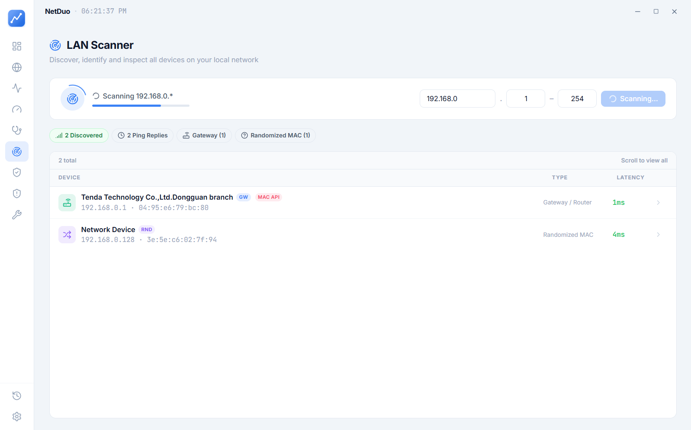
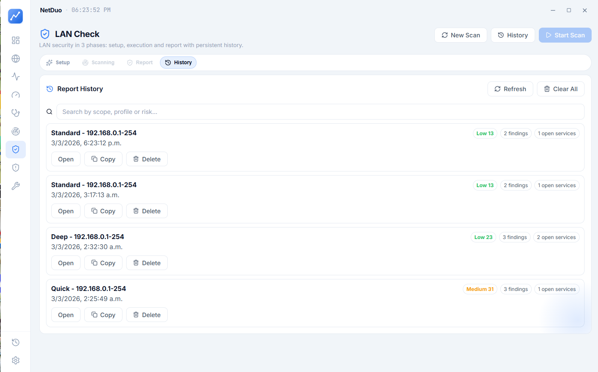
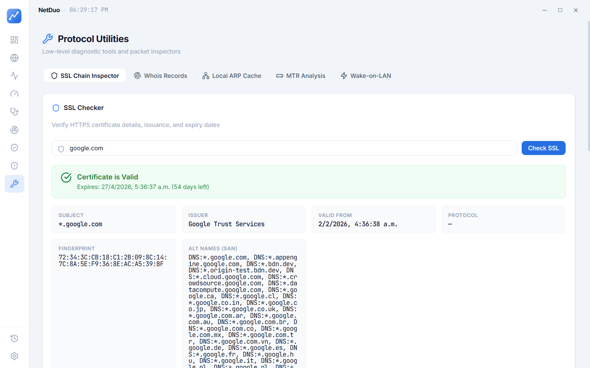

<p align="center">
  
</p>

<h1 align="center">NetDuo</h1>
<p align="center">
  Desktop Network Diagnostics and Security Auditing Suite
</p>

<p align="center">
  <a href="https://apps.microsoft.com/detail/9PP5SB94FD03">
    
  </a>
  
  
  
  
  
</p>

NetDuo is a production-oriented desktop app for network operations and security validation.
It combines real-time diagnostics, LAN discovery, WAN exposure testing, and historical reporting in a single workflow.

## Install

<p align="center">
  <a href="https://apps.microsoft.com/detail/9PP5SB94FD03">
    
  </a>
</p>

- **Microsoft Store (recommended):** [apps.microsoft.com/detail/9PP5SB94FD03](https://apps.microsoft.com/detail/9PP5SB94FD03) — auto-updates, clean install, no SmartScreen prompts.
- **Standalone installer:** grab the latest `NetDuo Setup X.Y.Z.exe` from [GitHub Releases](https://github.com/4ismael1/netduo/releases).

## Table of Contents

- [Install](#install)
- [Overview](#overview)
- [Key Features](#key-features)
- [Modules](#modules)
- [Screenshots](#screenshots)
- [Architecture](#architecture)
- [Tech Stack](#tech-stack)
- [Getting Started](#getting-started)
- [WAN Probe Integration](#wan-probe-integration)
- [Privacy](#privacy)
- [Security and Responsible Use](#security-and-responsible-use)
- [License](#license)

## Overview

NetDuo is built for:

- Security analysts validating local and public exposure.
- Sysadmins troubleshooting network performance and reachability.
- Advanced users who need faster insight than router dashboards alone.

Main value:

- Unified workflows: diagnostics + security posture in one UI.
- Persistent local history with SQLite.
- Multi-probe WAN analysis support.
- Actionable findings, not just raw scan output.

## Key Features

- Real-time latency, packet loss, and host monitoring.
- LAN device discovery with vendor, hostname, and MAC identification.
- LAN Check with staged scan pipeline and report history.
- WAN Check with synchronized multi-probe scanning.
- TCP/UDP transport modes with profile-based execution.
- Adaptive speed test (M-Lab NDT7, Cloudflare, Hetzner, OVH) with historical trends.
- Built-in protocol utilities (SSL, WHOIS, MTR, WoL, ARP, DNS benchmark, subnet calc).
- **Cancel anywhere**: every long-running operation (scan, speed test, probe, trace) can be stopped instantly from the UI.
- No telemetry, no analytics, no tracking — fully local.
- Desktop-native persistence and settings management.

## Modules

- `Dashboard`: health summary, local/public IP, gateway/DNS, Wi-Fi signal, quick actions.
- `Speed Test`: download/upload stages, latency/jitter, cancellable, per-run history.
- `Scanner`: LAN sweep with vendor detection, host detail modal, ping and open-port diagnostics.
- `Monitor`: continuous host telemetry for latency and packet loss with configurable alerts.
- `Diagnostics`: traceroute, live ping, MTR, parallel DNS resolution, port checker, port scanner.
- `Tools`: SSL inspector, HTTP tester, WHOIS, DNS benchmark, subnet calculator, ARP cache, Wake-on-LAN.
- `LAN Check`: setup → scanning → report → history workflow for local security auditing.
- `WAN Check`: quick/advanced/deep profiles, multi-probe orchestration, normalized findings.
- `Network`: full interface inventory, public IP with geolocation, Wi-Fi, VPN, DNS config.
- `History`: centralized activity timeline across every module.
- `Settings`: theme, accents, polling, alert thresholds, privacy policy link.

## Screenshots

Instead of a raw image dump, this section shows a quick product tour by workflow.

### 1) Dashboard (Light + Dark)

What this view is for:

- Immediate connection posture (local/public IP, gateway, DNS).
- Live latency cards and quality trend.
- Fast jump points to scanner, diagnostics, speed test, and tools.

<p>
  
  
</p>

### 2) WAN Check (Setup -> Execution -> Report)

What this view is for:

- Configure scan profile and transport strategy.
- Run synchronized scans across selected probes.
- Consolidate findings into a normalized security report.





### 3) LAN Security and Discovery

What this view is for:

- Define LAN Check scope and security profile.
- Discover active hosts in subnet scope.
- Review and compare persisted LAN reports.





### 4) Protocol Utilities

What this view is for:

- Execute low-level network/security utilities from one place.
- Validate certs, resolve ownership, run active diagnostics, and more.



## Architecture

```text
NetDuo (Electron App)
|- Electron Main (IPC, OS integrations, SQLite bridge)
|- React Renderer (UI modules + state + charts)
|- Local SQLite (history, reports, config)
`- Optional Remote WAN Probes (distributed external visibility)
```

Project layout:

```text
.
|- electron/                    # Main process + preload + DB layer
|- src/                         # React app (pages, components, styles)
|- docs/images/                 # README screenshots
`- dist-electron/               # Packaged desktop builds
```

## Tech Stack

- React 19
- Vite
- Electron
- better-sqlite3
- Recharts
- Framer Motion
- Lucide React
- Vitest + Testing Library

## Getting Started

### Requirements

- Node.js 18+ (20+ recommended)
- npm
- Windows recommended (current command integrations are Windows-first)

### Development

```bash
npm install
npm run dev
```

Runs:

- Vite dev server on `http://localhost:5173`
- Electron shell attached to that renderer

### Tests

```bash
npm test
```

### Build Installer

```bash
npm run electron:build
```

Build artifacts are generated in `dist-electron/`.

## WAN Probe Integration

WAN Check can use one or multiple probe agents for distributed external testing.

- Dedicated probe repository: https://github.com/4ismael1/netduo-wan-probe

Operational recommendation:

- Keep all probes on the same API version before running multi-probe scans.
- Validate probe versions via each probe `/version` endpoint.

## Privacy

NetDuo has no backend and collects no personal data. There is no telemetry, no analytics, and no tracking. All test history and settings live locally in SQLite inside the Windows user-data directory.

External requests are only made to public services you explicitly use (speed-test servers, DNS resolvers, WHOIS, MAC vendor lookup, public IP/geolocation).

Full policy: [4ismael1.github.io/netduo/privacy](https://4ismael1.github.io/netduo/privacy)

## Security and Responsible Use

NetDuo includes scanning and exposure analysis capabilities.
Use it only on networks/systems you own or where you have explicit authorization.

Unauthorized network scanning may violate law or policy.

## License

This project is licensed under the **PolyForm Noncommercial License 1.0.0**.

- Full text: [LICENSE](LICENSE)
- URL: `https://polyformproject.org/licenses/noncommercial/1.0.0`
- SPDX identifier: `PolyForm-Noncommercial-1.0.0`

Summary:

- Personal, educational, research, hobby, and noncommercial organizational use is allowed.
- Commercial use is not allowed under the default open license.
- If you redistribute, keep license and required notices.
- Required redistribution notices are listed in [NOTICE](NOTICE) and must remain included.

For paid/commercial usage, read [COMMERCIAL-LICENSE.md](COMMERCIAL-LICENSE.md).

---

Built and maintained by [@4ismael1](https://github.com/4ismael1).
